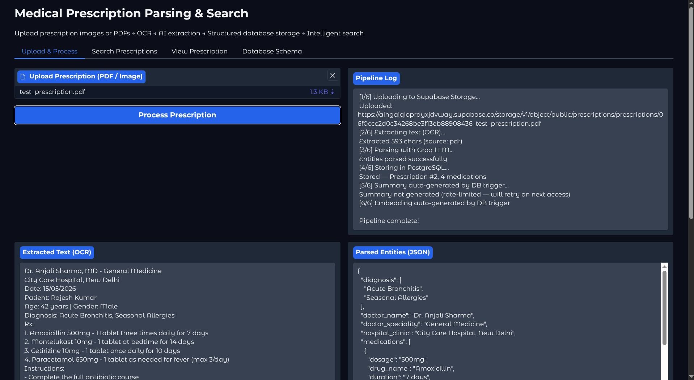
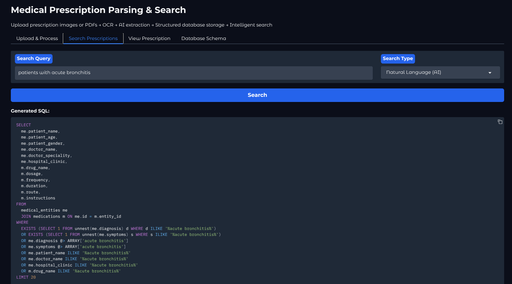

# Medical Prescription Parsing & Search

Upload prescriptions (PDF or image), extract structured medical data, and run various searches over it.

## How it works

```
PDF/Image → Supabase Storage → PyMuPDF + PaddleOCR → Groq LLM → PostgreSQL
                                                                      ↓
                                                          DB triggers generate
                                                        summary + embedding via
                                                              OpenRouter
```

On insert, database triggers call OpenRouter to produce a plain-text summary and a vector embedding. These power the semantic search.

## Project structure

```
.env.example
compose.yaml
init_db.sql
openrouter_functions.sql
app.py
main.py
requirements.txt
services/
  supabase_service.py
  extraction_service.py
  llm_service.py
  database_service.py
```


## Setup

### Getting API Keys

**Groq**
1. Go to [console.groq.com](https://console.groq.com)
2. Sign up / log in → API Keys → Create API Key
3. Copy the key into `GROQ_API_KEY`

**OpenRouter**
1. Go to [openrouter.ai](https://openrouter.ai)
2. Sign up / log in → Keys → Create Key
3. Copy the key into `OPENROUTER_API_KEY`
4. The free models (`nvidia/llama-nemotron-embed-vl-1b-v2:free`, `google/gemma-4-31b-it:free`) work without adding credits

**Supabase**
1. Go to [supabase.com](https://supabase.com) → New project
2. Settings → API → copy `Project URL` into `SUPABASE_URL`
3. Copy the `anon/public` key into `SUPABASE_KEY`
4. Storage → New bucket → name it `prescriptions` (or match `SUPABASE_BUCKET`)

**PostgreSQL**
No external account needed — the database runs locally via Docker. Just set a `POSTGRES_PASSWORD` of your choice in `.env` and it matches `compose.yaml` automatically.
```bash
cp .env.example .env
```

Fill in your `GROQ_API_KEY`, `OPENROUTER_API_KEY`, `SUPABASE_URL`, `SUPABASE_KEY`, and `POSTGRES_PASSWORD`.

Start the database:

```bash
docker compose up -d
```

This brings up TimescaleDB (pg17 + pgvector + pgai) and a vectorizer worker. On first boot `init_db.sql` sets up the schema, functions, and triggers.

Install Python deps:

```bash
pip install -r requirements.txt
```

## Usage

```bash
python app.py
```

Runs on `http://localhost:7860`.


## Outputs





## Stack

- **Groq** — LLM extraction via tool calling, natural-language-to-SQL search
- **OpenRouter** — summary generation and embeddings (called from PL/pgSQL triggers)
- **PostgreSQL + pgvector** — structured storage, trigram indexes, full-text search, vector similarity
- **PaddleOCR** — OCR for scanned documents and images
- **Supabase** — file storage
- **Gradio** — web frontend
